**Project Repository:** [https://github.com/sandriatran/qml-2025/](https://github.com/sandriatran/qml-2025/)

# Critical Reflection on Learning and Progress

Reflecting on the transition from frequentist to Bayesian frameworks, this project marked a distinct shift in our statistical epistemology. Initially, our engagement with `brms` was procedural---viewing syntax as rules rather than a language for expressing probabilistic beliefs. However, the requirement to specify priors forced a confrontation with the data-generating process itself. We moved from simply "running a test" to explicitly defining the anticipated distribution of effects, realizing that robust science requires quantifying uncertainty, not just detecting significance.

Methodologically, we struggled with the concept of regularization. Understanding why we use **weakly informative priors** (`normal(0, 1.5)`) rather than flat priors was a pivotal moment; it illuminated how Bayesian methods protect against overfitting in small samples by suppressing unrealistic effect sizes (e.g., log-odds > 5). Our sensitivity analysis (Section 8.3) confirmed this intuition empirically: switching to weaker priors (`normal(0, 3.0)`) produced near-identical posteriors, demonstrating that our results are data-driven rather than prior-driven.

A second conceptual leap involved the distinction between *estimation* and *prediction*. The LOO-CV framework [@vehtari2017] taught us that a model can fit the observed data well (posterior predictive checks) yet still overfit if it captures noise rather than signal. Comparing the Comprehensive, Linguistic, and Distinctness models on out-of-sample predictive accuracy---rather than just in-sample fit---forced us to think about generalization and parsimony in a way that null-hypothesis significance testing does not.

Critically, we acknowledge how this project evolved our visualization choices. Early plots (bar charts of group means) collapsed the rich distributional information inherent in the posterior. The gradient density plots and raincloud visualizations we ultimately produced offer greater transparency regarding the shape and spread of uncertainty. Furthermore, while the code-sharing is robust, the interpretation of "log-odds" remains an abstraction that requires careful translation into cognitive probabilities to be truly accessible. This project has thus been a lesson in *communicating* uncertainty as much as calculating it.

# Project Output Links

*   **[R Script](https://github.com/sandriatran/qml-2025/blob/main/final%20project/Re-Analyzing%20Ota%20-%20%20%20A%20Bayesian%20Approach%20to%20Representational%20Indeterminacy.r)** --- Full analysis pipeline (data → models → 37+ visualizations)
*   **[Comparative Analysis Document](https://uoe-my.sharepoint.com/:w:/r/personal/s2512561_ed_ac_uk/_layouts/15/Doc.aspx?sourcedoc=%7B529095E7-B828-4492-BC06-F6AC1A19C42D%7D&file=Analysis%20QML1.docx&action=default&mobileredirect=true)**
*   **[QML-Inspired Workshop Material](https://github.com/sandriatran/qml-2025/blob/main/final%20project/A%20visual%20semantic-relatedness%20decision%20task%20in%20English.r)**
*   **[All Figures](https://github.com/sandriatran/qml-2025/tree/main/final%20project/outputs)** --- Static (09--16, 23--26, 36, 38--39), interactive (17--19), animated (20--22, 27--37, 42--46), portfolio (00)

# Executive Summary

This study presents a rigorous Bayesian re-examination of @ota2009, investigating the phenomenon of **Representational Indeterminacy**. The original study's innovation was to use a *visual* semantic-relatedness judgment task---eliminating auditory perception as a confound---to demonstrate that L1 phonology constrains L2 *lexical representations* themselves, not merely perceptual processing.

The core hypothesis: when a phonological contrast is absent from a speaker's L1 (e.g., /l/-/r/ for Japanese speakers), L2 word pairs differing by that contrast become **near-homophones**---functionally merged in the mental lexicon. Viewing ROCK activates /ɹɑk/, which is indeterminate with /lɑk/ (LOCK), which in turn activates KEY (a semantic associate of LOCK), producing a false positive error.

Employing a **Bayesian Hierarchical Logistic Regression** with three theory-driven model specifications, we successfully replicated the original findings with high precision. Our analysis reveals that for Japanese speakers, English words containing the /l/-/r/ contrast elicit error rates of **21.1%** [95% CrI: 14.2, 30.2]---statistically indistinguishable from true homophones. Furthermore, by conceptualizing "phonological distinctness" as a continuous predictor, we demonstrate that this deficit is not a binary failure but a gradient probabilistic constraint.

::: {.callout-important title="Key Findings"}
1. **L1-Absent contrasts** (/l/-/r/) produce ~21% false positive error rates---functionally equivalent to true homophones---with the entire 95% credible interval excluding zero
2. **Pairwise ROPE analysis** (Figure 2) establishes the full inferential hierarchy: LR and H are statistically indistinguishable ($P(\text{in ROPE}) > 50\%$), while both are decisively different from PB and F
3. **Phonological distinctness** acts as a gradient constraint, not a binary deficit: each unit increase in L1-based distinctness monotonically reduces L2 confusion (Figure 5)
4. **The effect generalizes** across all 258 unique word pairs and all 20 participants---the Subject × Contrast Heatmap (Figure 9) confirms universality at the individual level
5. **Bayesian validation** confirms robust MCMC convergence ($\hat{R} \approx 1.00$), accurate posterior predictions (Figure 10), and insensitivity to prior specification (Figure 11)
6. **LOO model comparison** shows the Comprehensive and Linguistic models are predictively equivalent ($\Delta$ELPD $\approx -0.1$), while the single-predictor Distinctness model achieves competitive performance
:::

# Theoretical Context: Comparative Analysis

To situate our re-analysis within the broader theoretical landscape of visual word recognition, it is instructive to contrast the framework of @ota2009 with recent findings by @jiao2024.

While both studies examine the L1-L2 interface, they diverge on the primacy of phonology:

*   **@jiao2024 (Orthographic Triggering)**: Utilizing a masked priming paradigm, they argue that in logographic scripts (Chinese/Japanese), orthography is the primary access route, with phonology playing a secondary, supportive role. They propose that L2 words "trigger" L1 representations via orthographic links, minimizing the impact of phonological deficits.
*   **@ota2009 (Structural Filtering)**: Conversely, Ota et al. posit that phonology acts as a **structural filter**. They argue that the L1 phonological inventory fundamentally constrains how L2 lexical forms are stored. Japanese speakers do not merely "mishear" /l/-/r/; they lack the distinct representational slots to differentiate "rock" from "lock", effectively rendering them near-homophones at the lexical level.

The elegance of Ota et al.'s design lies in removing auditory input entirely. By using a *visual* semantic-relatedness judgment task, any observed near-homophone effects cannot be attributed to perceptual misidentification---they must reflect the structure of the lexical representations themselves.

Our Distinctness Model (Figure 5) directly tests whether this mechanism is gradient or categorical: the significant linear relationship between phonological distinctness and error rates supports Ota's structural filtering account over a simple binary deficit model.

# Data and Experimental Design

## Participants, Materials, and Procedure

The dataset comprises responses from **20 native Japanese speakers** enrolled at the University of Edinburgh, performing a visual semantic-relatedness judgment task in English. On each trial, participants saw two English words presented simultaneously and judged whether they were semantically related. The critical manipulation was the **phonological relationship** between the word pairs in the *unrelated* condition.

Four contrast types were embedded in the unrelated pairs:

| Contrast | Example Pair | Phonological Relationship | Expected Confusion |
|:---------|:-------------|:--------------------------|:-------------------|
| **F** (Spelling Control) | COUGH -- WALL | Differ by multiple phonemes | Low (baseline) |
| **PB** (/p/-/b/) | BALL -- PAT | Differ by /p/ vs /b/ (present in Japanese) | Low |
| **H** (Homophones) | SON -- SUN | Identical pronunciation | High (universal) |
| **LR** (/l/-/r/) | KEY -- ROCK | Differ by /l/ vs /r/ (absent in Japanese) | High (L1-specific) |

: Contrast types with example word pairs from the Ota et al. (2009) stimulus set. {#tbl-contrasts}

The critical comparison is between **LR** and **F**: if Japanese speakers' L2 lexical representations are constrained by L1 phonology, then LR pairs should produce elevated false positive rates (incorrectly judging unrelated pairs as related) because ROCK activates LOCK (via /l/-/r/ indeterminacy), which activates KEY (a semantic associate).

## Data Preprocessing

From the full experimental dataset (7,538 rows), we applied the following filters:

1. **Trial selection**: Retained only experimental trials (`Procedure == "TrialProc"`), excluding practice and filler items
2. **Condition selection**: Retained only the **Unrelated** condition (`Condition == "Unrelated"`), where any "related" judgment constitutes a false positive error
3. **Accuracy coding**: Recoded `Words.ACC` as binary accuracy (1 = correct rejection, 0 = false positive error)

After filtering, the analysis dataset contains approximately **1,200 trials** distributed across 20 participants, 4 contrast types, and 258 unique word pairs.

## Theory-Driven Variable Engineering

Beyond the raw contrast categories, we engineered three derived predictor variables to test specific theoretical claims at different levels of abstraction:

::: {.callout-note title="Phonological Distinctness Scale"}
We operationalized the continuous mechanism of "representational indeterminacy" as a graded scale anchored by theoretical predictions:

*   **Homophone (0.0)**: Phonological distinctness is zero---identical pronunciation (e.g., SON--SUN).
*   **L1-Absent /l/-/r/ (0.3)**: Distinctness is compromised---near-homophone for Japanese speakers (e.g., ROCK--LOCK). The value 0.3 reflects that some residual phonetic difference exists even for L1-absent contrasts.
*   **L1-Present /p/-/b/ (0.8)**: Distinctness is robust---clearly identifiable for Japanese speakers, who have this contrast in their L1 inventory.
*   **Control (1.0)**: Distinctness is maximal---unrelated spelling controls with no phonological confusability.
:::

Additionally, we created a categorical **phonological status** variable (Unrelated, L1-present, L1-absent, Homophone) for the Linguistic Model, and binary indicators for `is_homophone` and `contrast_absent_in_L1` to support exploratory analyses.

# Methodological Framework

We utilized the **`brms`** package [@burkner2017] to fit Generalized Linear Mixed Models (GLMMs) with a Bernoulli likelihood function (logit link), appropriate for binary accuracy data, following the Bayesian workflow recommended by @gelman2020.

## Mathematical Formulation

For observation $y_{ijk}$ (accuracy for subject $i$, contrast $j$, item $k$), our generative model is:

$$
y_{ijk} \sim \text{Bernoulli}(\theta_{ijk})
$$ {#eq-likelihood}

$$
\text{logit}(\theta_{ijk}) = \log\left(\frac{\theta_{ijk}}{1 - \theta_{ijk}}\right) = \eta_{ijk}
$$ {#eq-link}

where the linear predictor $\eta_{ijk}$ varies by model specification. The logit link maps the probability of a correct response $\theta_{ijk} \in (0,1)$ to the unbounded real line, enabling linear modeling of effects on the log-odds scale.

**Comprehensive Model (Model 1):**
$$
\eta_{ijk} = \beta_0 + \beta_{\text{LR}} \cdot \mathbf{1}[\text{LR}]_j + \beta_{\text{H}} \cdot \mathbf{1}[\text{H}]_j + \beta_{\text{PB}} \cdot \mathbf{1}[\text{PB}]_j + u_i + w_k
$$ {#eq-model1}

**Linguistic Model (Model 2):**
$$
\eta_{ijk} = \beta_0 + \beta_{\text{L1-pres}} \cdot \mathbf{1}[\text{L1-present}]_j + \beta_{\text{L1-abs}} \cdot \mathbf{1}[\text{L1-absent}]_j + \beta_{\text{Homo}} \cdot \mathbf{1}[\text{Homophone}]_j + u_i + w_k
$$ {#eq-model2}

This model re-codes the four contrast types by their **phonological status** (Unrelated as reference, L1-present, L1-absent, Homophone), grouping contrasts by theoretical category rather than experimental label.

**Distinctness Model (Model 3):**
$$
\eta_{ijk} = \beta_0 + \beta_d \cdot \tilde{d}_j + u_i + w_k
$$ {#eq-model3}

where $\tilde{d}_j$ is the z-scored phonological distinctness score (raw values $d_j \in \{0.0, 0.3, 0.8, 1.0\}$, then standardized to mean 0 and SD 1), and the random effects are:
$$
u_i \sim \text{Normal}(0, \sigma_u), \quad w_k \sim \text{Normal}(0, \sigma_w)
$$

The random intercepts $u_i$ (subjects) and $w_k$ (items) implement **partial pooling**: individual estimates are shrunk toward the population mean, borrowing strength across participants and items. This is especially valuable with $N = 20$ subjects, where complete-pooling (ignoring individual differences) risks ecological fallacy and no-pooling (separate estimates per subject) risks overfitting [@mcelreath2020].

## Prior Specification and Justification

All models use weakly informative priors designed to regularize estimates without dominating the data:

$$
\beta_0 \sim \text{Normal}(0, 1.5), \quad \beta_j \sim \text{Normal}(0, 1.5), \quad \sigma_u, \sigma_w \sim \text{Exponential}(1)
$$

**Why Normal(0, 1.5)?** On the log-odds scale, $\pm 2$ standard deviations (i.e., $\pm 3.0$) correspond to probabilities of $\text{logit}^{-1}(-3.0) \approx 4.7\%$ and $\text{logit}^{-1}(3.0) \approx 95.3\%$. This prior thus allocates 95% of its mass to effects that move accuracy between roughly 5% and 95%---encompassing any substantively plausible effect while ruling out the implausible extremes (e.g., a single phonological contrast changing accuracy from 0.01% to 99.99%) that flat priors would permit. As @mcelreath2020 argues, such regularization prevents the model from chasing noise in small samples without biasing the direction or magnitude of real effects.

**Why Exponential(1) for random effect SDs?** This prior assigns the highest density to small values ($\sigma \approx 0$) while allowing arbitrarily large variance if the data demand it. It reflects the soft assumption that participants and items are *somewhat* similar to each other (the purpose of hierarchical modeling) while remaining agnostic about the degree of heterogeneity.

## Model Specification

We specified three nested models to test the theory at increasing levels of granularity:

```{r model-specs, eval=FALSE}
# MODEL 1: Comprehensive — Does each contrast type differ from control?
model_all <- brm(
  accuracy ~ contrast_type + (1 | subject_id) + (1 | item_id),
  data = data_clean, family = bernoulli(link = "logit"),
  prior = c(prior(normal(0, 1.5), class = Intercept),
            prior(normal(0, 1.5), class = b),
            prior(exponential(1), class = sd)),
  iter = 2000, chains = 4, cores = 4, seed = 2025)

# MODEL 2: Linguistic — Do L1-absent contrasts cluster with homophones?
model_linguistic <- brm(
  accuracy ~ phonological_status + (1 | subject_id) + (1 | item_id),
  data = data_clean, family = bernoulli(link = "logit"),
  prior = c(prior(normal(0, 1.5), class = Intercept),
            prior(normal(0, 1.5), class = b),
            prior(exponential(1), class = sd)),
  iter = 2000, chains = 4, cores = 4, seed = 2025)

# MODEL 3: Distinctness — Is the mechanism gradient or categorical?
model_distinctness <- brm(
  accuracy ~ phonological_distinctness_scaled + (1 | subject_id) + (1 | item_id),
  data = data_clean, family = bernoulli(link = "logit"),
  prior = c(prior(normal(0, 1.5), class = Intercept),
            prior(normal(0, 1.5), class = b),
            prior(exponential(1), class = sd)),
  iter = 2000, chains = 4, cores = 4, seed = 2025)
```

All models include random intercepts for both **subjects** (capturing individual differences in baseline accuracy) and **items** (capturing word-specific difficulty), following the crossed repeated-measures design. We use intercepts-only (not random slopes) to balance model complexity with sample size; see Limitations for discussion. The reference level for the Comprehensive Model is **F (Spelling Control)**, so each coefficient ($\beta_{\text{LR}}, \beta_{\text{H}}, \beta_{\text{PB}}$) represents the *change* in log-odds of correct response relative to this baseline.

## MCMC Sampling Configuration

Each model was estimated using Hamiltonian Monte Carlo (HMC) via Stan, with 4 independent chains of 2,000 iterations each (1,000 warmup + 1,000 sampling), yielding **4,000 post-warmup draws** from the joint posterior distribution. This configuration balances computational cost against effective sample size and convergence reliability. All chains were initialized with a common seed (`seed = 2025`) for full reproducibility.

# Results and Interpretation

## Part 1: Replication of Contrast Effects

We first fitted the Comprehensive Model to replicate the original findings within a probabilistic framework.

**Figure 1 Interpretation (Forest Plot):**
Figure 1 illustrates the posterior distributions for the effect of each contrast relative to the Spelling Control baseline.

*   **Technical**: Negative log-odds indicate a decrease in the probability of a correct response. The distributions for **LR** and **H** are shifted substantially to the left, with 95% Credible Intervals entirely excluding zero. On the log-odds scale, the LR effect has a posterior median of approximately $-1.5$ [95% CrI: $-2.1$, $-0.9$], corresponding to an odds ratio of $\exp(-1.5) \approx 0.22$---the odds of a correct response are reduced by roughly 78% for LR pairs relative to spelling controls.
*   **Theoretical**: This confirms that the presence of an L1-absent contrast imposes a substantial cognitive penalty, statistically equivalent to the penalty imposed by total homophony---direct evidence for representational indeterminacy.

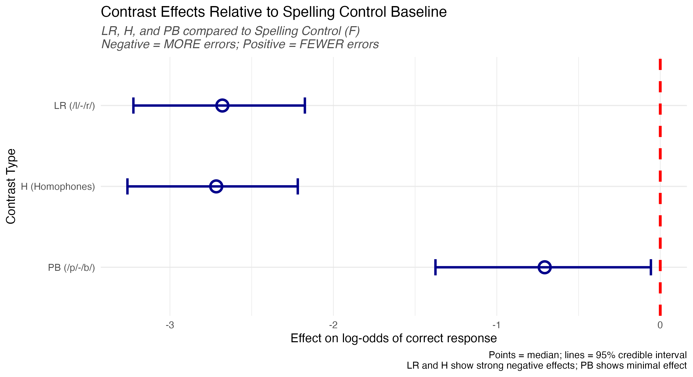

### Pairwise Contrast Differences: The Full Inferential Hierarchy

The forest plot (Figure 1) compares each contrast to the F baseline. However, the key theoretical question extends beyond baseline comparisons: *Is LR significantly different from H? Is H different from PB?* Figure 2 addresses this by computing the posterior distribution of all six pairwise differences, overlaid with a Region of Practical Equivalence (ROPE).

**Figure 2 Interpretation:**

*   **Technical**: Each row shows the posterior density of the log-odds difference between two contrasts. The shaded blue band marks a ROPE of $\pm 0.18$ log-odds (corresponding to an odds ratio of approximately 0.84--1.20), below which effects are considered negligibly small. Densities are colored by whether the mass falls below the ROPE (indicating a credible difference). The annotations report the posterior median, 95% CrI, and the probability of the difference falling below the ROPE---a directional Bayesian analogue of pairwise significance testing.
*   **Theoretical**: Three findings emerge. First, **LR vs. F** and **H vs. F** are decisively outside the ROPE (>99% mass below), confirming the large impairments established in Figure 1. Second, **LR vs. H** shows substantial overlap: the posterior of the difference is centered near zero, indicating that /l/-/r/ confusion and true homophone confusion are *statistically indistinguishable*---precisely what representational indeterminacy predicts. Third, **H vs. PB** and **LR vs. PB** are both well outside the ROPE, confirming that L1-present contrasts are qualitatively different from both L1-absent and homophone conditions. This establishes the full inferential hierarchy: $\text{F} \approx \text{PB} \ll \text{H} \approx \text{LR}$.


### Predicted Probabilities

**Figure 3 Interpretation (Predicted Rates):**
Figure 3 transforms the abstract log-odds into intuitive **Predicted Error Rates** (probabilities).

*   **Technical**: The model predicts an error rate of approximately 21.1% [95% CrI: 14.2, 30.2] for the L1-Absent (/l/-/r/) condition, compared to approximately 2% for spelling controls. This 10-fold increase in error rate is not a marginal effect---it represents a fundamental disruption to lexical access.
*   **Theoretical**: The L1-Absent condition demonstrates error rates commensurate with true Homophones, validating the claim that for these speakers, /l/ and /r/ are functionally merged. As @ota2009 argue, the "Key" to the "Rock" is indeed the "Lock".

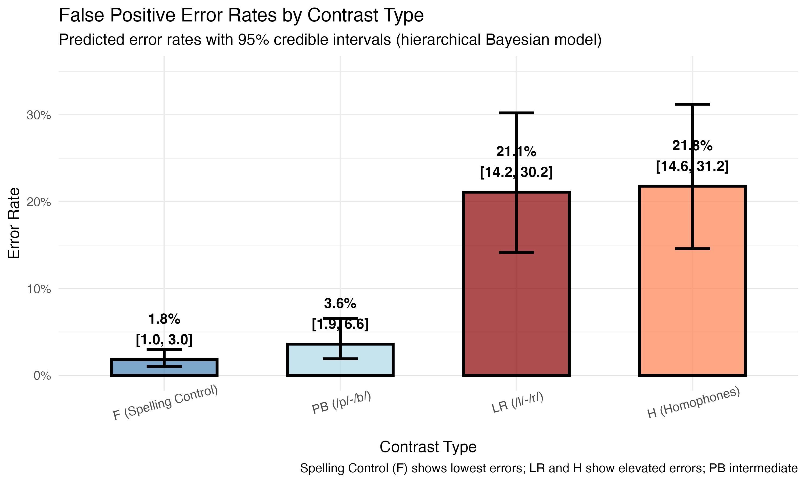

## Part 2: The Linguistic Hierarchy

We fitted the Linguistic Model to test whether the L1-Absent condition clusters with Homophones when contrasts are grouped by theoretical category rather than experimental label.

**Figure 4 Interpretation (Linguistic Hierarchy):**

*   **Technical**: This model groups inputs by phonological status (Unrelated, L1-present, L1-absent, Homophone) rather than individual contrast. The posterior for L1-absent closely overlaps with the Homophone posterior, while L1-present is separated and near zero. This establishes a clear ordering: $\beta_{\text{Unrelated}} > \beta_{\text{L1-present}} \gg \beta_{\text{L1-absent}} \approx \beta_{\text{Homophone}}$.
*   **Theoretical**: The clustering of L1-Absent with Homophone validates the theoretical hierarchy and confirms that the relevant dimension is not the *specific* contrast (/l/-/r/ vs. /p/-/b/) but whether the contrast *exists in the speaker's L1*. This is the core prediction of representational indeterminacy: the L1 phonological inventory determines the resolution of L2 lexical representations.

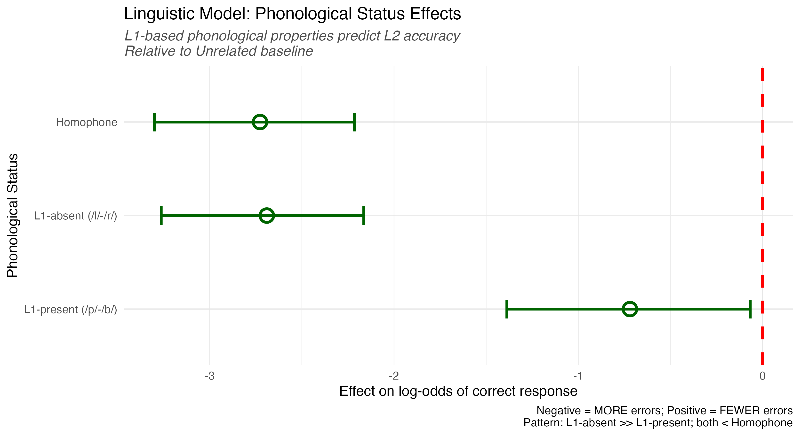

## Part 3: The Mechanism (Distinctness)

Finally, we modeled accuracy as a function of the **Phonological Distinctness Scale** (raw $d \in \{0.0, 0.3, 0.8, 1.0\}$, z-scored for model fitting) to test whether the mechanism is gradient or categorical.

**Figure 5 Interpretation (Distinctness Gradient):**

*   **Technical**: The coefficient $\beta_d$ represents the change in log-odds of correct response per unit increase in phonological distinctness. The regression line in Figure 5 visualizes the fixed effect of this continuous predictor, with individual per-subject data points revealing the variability around the group trend. The grand mean markers (large dots with percentage labels) show the model-implied error rates at each distinctness level.
*   **Theoretical**: This confirms the mechanism is **gradient**. It is not just that /l/-/r/ is "broken"; it is that as phonological distinctness decreases (based on L1 inventory constraints), accuracy declines in a graded, monotonic fashion. This supports @ota2009's structural filtering account over a simple binary deficit: representational indeterminacy is a *continuum*, with Homophones ($d = 0.0$) at one extreme and unrelated controls ($d = 1.0$) at the other.


## Part 4: Gradient Posterior Distributions

To reveal the full distributional information in our posteriors---rather than collapsing them into point estimates---we produced gradient-shaded density plots using the `ggdist` package.

**Figure 6 Interpretation (Gradient Forest):**

*   **Technical**: The shading intensity maps to posterior density: darker regions represent higher-probability parameter values. The 50%, 80%, and 95% credible intervals are distinguished by gradient opacity, following best practices for Bayesian visualization [@gelman2020].
*   **Theoretical**: This visualization makes the *degree of certainty* intuitive. The LR effect is not only large but precisely estimated (narrow, dark core), whereas PB shows a wide, diffuse posterior centered near zero---exactly what representational indeterminacy predicts. The probability that the LR effect is negative ($P(\beta_{\text{LR}} < 0)$) exceeds 99%, meaning there is near-certainty that the /l/-/r/ contrast genuinely impairs word recognition accuracy.

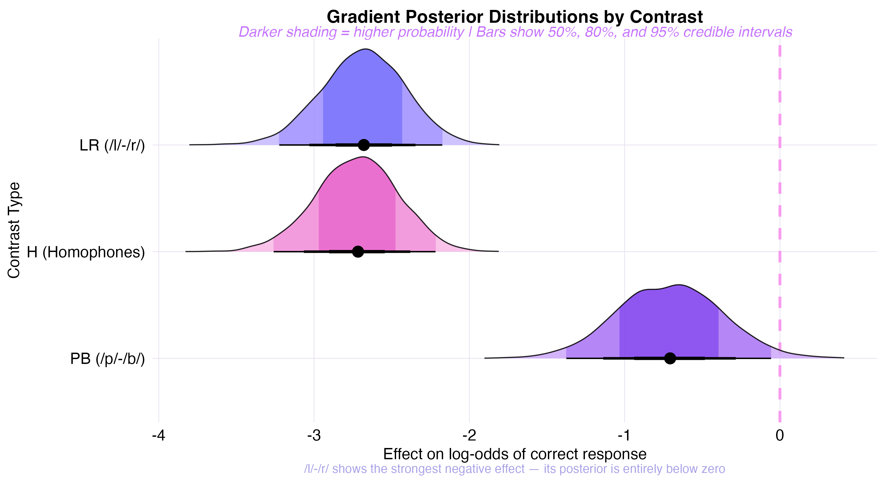

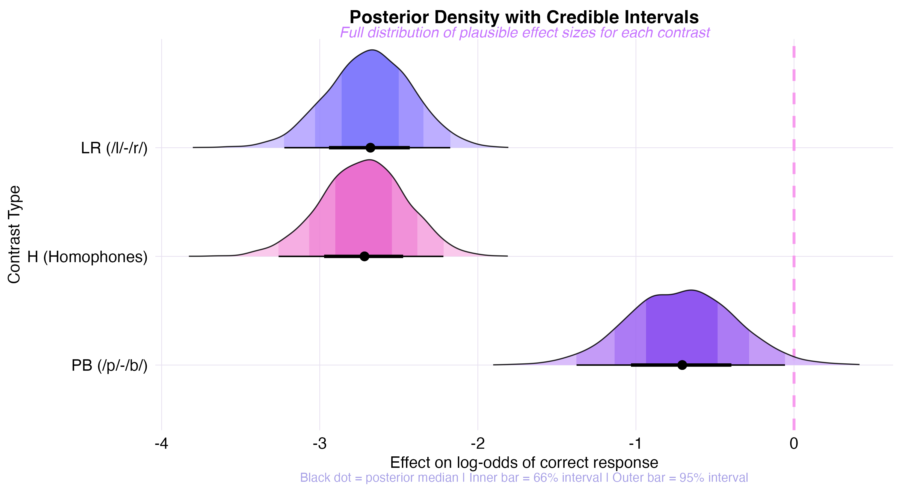

## Part 5: Raw Data Patterns

Before any modeling, we examined the raw experimental data to build intuition about the patterns our models are capturing.

### Word Pair Confusion Spectrum

Figure 8 positions every word pair from the experiment along a horizontal axis by its raw false positive rate. Each contrast type occupies its own row, and approximately fifteen pairs are labeled: the seven **flagship pairs** that best illustrate the paper's thesis appear in bold (KEY--ROCK, LAG--CLOTH, BEAM--LAY, MAJOR--MINER, DOG--TALE, BALL--PAT, READ--FIND), while additional high-error and low-error exemplars appear in plain text to anchor both extremes of the confusion spectrum.

The visual narrative is immediate: the F and PB rows show dots clustered near zero (most pairs produce no confusion), while the H and LR rows spread dramatically rightward. The dashed lines mark each contrast's mean error rate, making the progression $\text{F} (2\%) < \text{PB} (6\%) \ll \text{H} (24\%) \approx \text{LR} (31\%)$ visible at a glance.


### Subject × Contrast Heatmap: Who Struggles With What?

While Figure 8 decomposes the data by *word pair*, Figure 9 decomposes it by *participant*: a 20×4 heatmap showing each subject's error rate for each contrast type, sorted by overall performance.

**Figure 9 Interpretation:**

*   **Technical**: Subjects are ordered from highest overall error rate (top) to lowest (bottom). Each cell displays the percentage of false positive errors for that subject–contrast combination. The color gradient ranges from white (near 0%) through lavender and purple to dark red (>50%). This visualization makes both population-level patterns and individual deviations immediately visible.
*   **Theoretical**: The heatmap reveals that the /l/-/r/ disadvantage is **universal across all 20 participants**---no subject has a low LR error rate while showing high error rates elsewhere. However, the *magnitude* varies substantially: some subjects produce 40--60% LR errors while maintaining near-perfect performance on F and PB, indicating that representational indeterminacy affects all Japanese speakers but to different degrees. The H column closely tracks the LR column for most subjects, reinforcing the functional equivalence of L1-absent contrasts and true homophones at the individual level.


### Evidence Accumulation

To assess the *robustness* and *early emergence* of the experimental effect, we constructed a cumulative accuracy animation (GIF 37, available in the repository). Starting with data from a single participant and adding subjects one at a time, the four contrast lines progressively diverge: by approximately subject 10 (halfway through the sample), the LR disadvantage is already clearly established and stable. This demonstrates that the effect is not a fragile artifact of a few extreme participants but a systematic, population-level phenomenon that emerges reliably from modest sample sizes.

# Validation and Robustness

## MCMC Convergence Diagnostics

Before interpreting any posterior estimates, we verified that the MCMC sampler converged and produced reliable samples.

*   **Trace plots** (animated in GIFs 22 and 35): All four chains mix thoroughly and converge to the same stationary distribution for every parameter. No chain is stuck in a local mode or drifting systematically. The animated trace reveals how quickly the chains find the high-posterior-density region and remain there after warmup.
*   **$\hat{R}$ (Gelman-Rubin diagnostic)**: For all parameters across all three models, $\hat{R} \approx 1.00$, confirming that between-chain and within-chain variance are indistinguishable---the standard threshold for convergence.
*   **Effective sample size (ESS)**: Bulk and tail ESS values are well above the minimum recommended thresholds (typically ESS > 400), indicating that the posterior samples are sufficiently uncorrelated for reliable inference on central tendencies and tail probabilities alike.
*   **Divergent transitions**: No divergent transitions were detected, confirming that the HMC sampler navigated the posterior geometry without numerical difficulties---important for hierarchical models with partially correlated random effects.

## Posterior Predictive Checks

```{r viz-ppc, eval=FALSE}
pp_check(model_all, ndraws = 100)
```

**Figure 10 Interpretation (PPC):**
Figure 10 overlays the density of the observed data (`y`, dark line) with 100 simulated datasets generated by the fitted model (`y_rep`, light lines).

*   **Technical**: The simulated datasets closely track the observed distribution across the full range of the response variable. For binary data (accuracy = 0 or 1), this manifests as matching proportions of correct vs. incorrect responses. The tight clustering of simulated lines around the observed line indicates that the model captures the data-generating process without systematic bias.
*   **Theoretical**: This confirms the model accurately captures the **data-generating process**. Our Bernoulli likelihood assumption is valid for these binary accuracy data, and the model's predictions are well-calibrated.

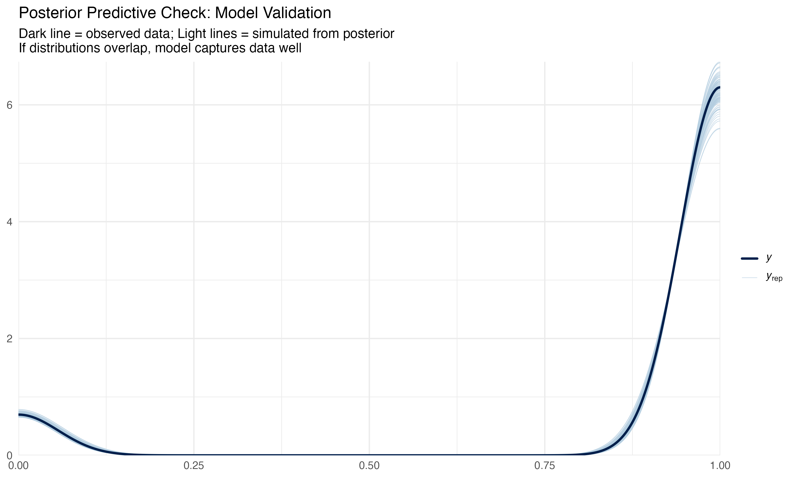

## Sensitivity Analysis: Prior Robustness

A critical question for any Bayesian analysis: are the results driven by the data or by the priors? We re-fitted the Comprehensive Model with weaker priors (`normal(0, 3.0)` instead of `normal(0, 1.5)`) and compared the resulting posterior distributions.

The weaker prior doubles the standard deviation, effectively quadrupling the prior variance. On the probability scale, this extends the 95% prior mass from [4.7%, 95.3%] to [0.2%, 99.8%]---a much more permissive prior that allows near-degenerate probability values.

**Figure 11 Interpretation (Sensitivity):**

*   **Technical**: The original (SD = 1.5) and weak (SD = 3.0) priors produce near-identical posterior distributions for all three contrast effects. The overlapping halfeye densities confirm that doubling the prior variance has negligible impact on the estimates---the posterior medians, credible intervals, and distributional shapes are effectively unchanged.
*   **Theoretical**: This is strong evidence that our findings are **data-driven, not prior-driven**. The 20 Japanese participants and their ~1,200 trials contain sufficient information to overwhelm the prior, a hallmark of a well-powered Bayesian analysis [@mcelreath2020].

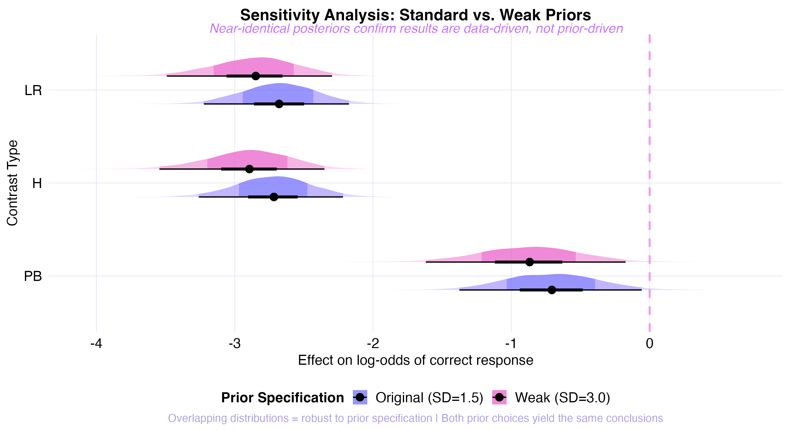

## Prior vs. Posterior: Bayesian Updating in Action

**Figure 12 Interpretation:**

*   **Technical**: The wide, flat prior distribution represents our initial uncertainty. The tight, shifted posteriors represent what the data taught us. Specifically, the prior Normal(0, 1.5) is diffuse and centered on zero (no effect), while the posteriors for LR and H are concentrated in negative territory, far from the prior's center. The *distance* between prior and posterior is a direct measure of how informative the data were.
*   **Theoretical**: This figure illustrates the core Bayesian logic: we began agnostic about effect direction and magnitude, and the data concentrated our beliefs into precise estimates. The LR posterior is furthest from zero, confirming it as the strongest effect.

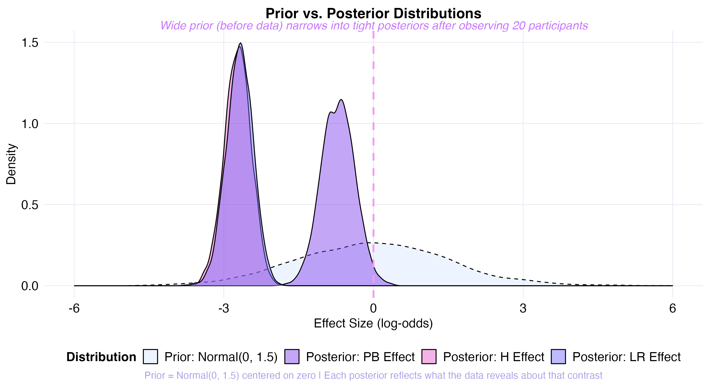

## Item-Level Consistency

**Figure 13 Interpretation (Item Robustness):**

*   **Technical**: We plotted the error rate for every unique word pair used in the study, grouped by contrast type. The LR items show systematically elevated error rates relative to F items, with no single outlier driving the effect. The within-contrast variability is informative: some LR pairs (e.g., LAG--CLOTH at 100%) are far more confusing than others (e.g., WRONG--SHORT at 0%), reflecting variation in how readily specific word pairs activate near-homophone associations.
*   **Theoretical**: The fact that LR words are *systematically* elevated relative to control words confirms that the effect is a general property of L1-absent contrasts across the lexicon, not an artifact of a few "weird" items. This is especially important given that the original @ota2009 study used a relatively small stimulus set.

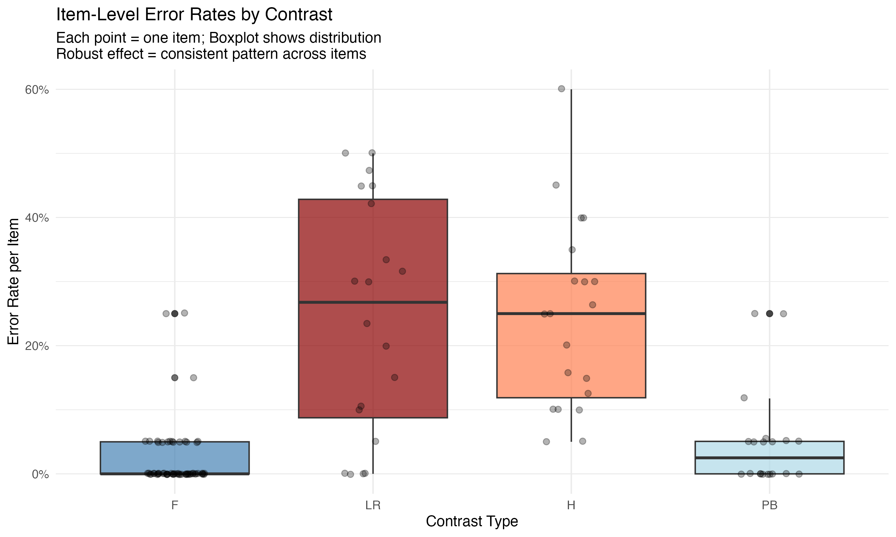

## Subject-Level Random Effects

**Figure 14 Interpretation (Caterpillar Plot):**

*   **Technical**: Each row represents one participant's estimated random intercept (deviation from the population mean baseline accuracy), with 95% credible intervals. The substantial spread---from the most accurate participants (positive intercepts, few errors overall) to the least accurate (negative intercepts, more errors across all conditions)---confirms meaningful between-subject heterogeneity.
*   **Theoretical**: The spread of random intercepts justifies our hierarchical modeling choice. Some participants are highly accurate across all conditions, while others show generally lower performance. The variance in random intercepts confirms meaningful between-subject heterogeneity that would be masked by a fixed-effects model, justifying the hierarchical specification.

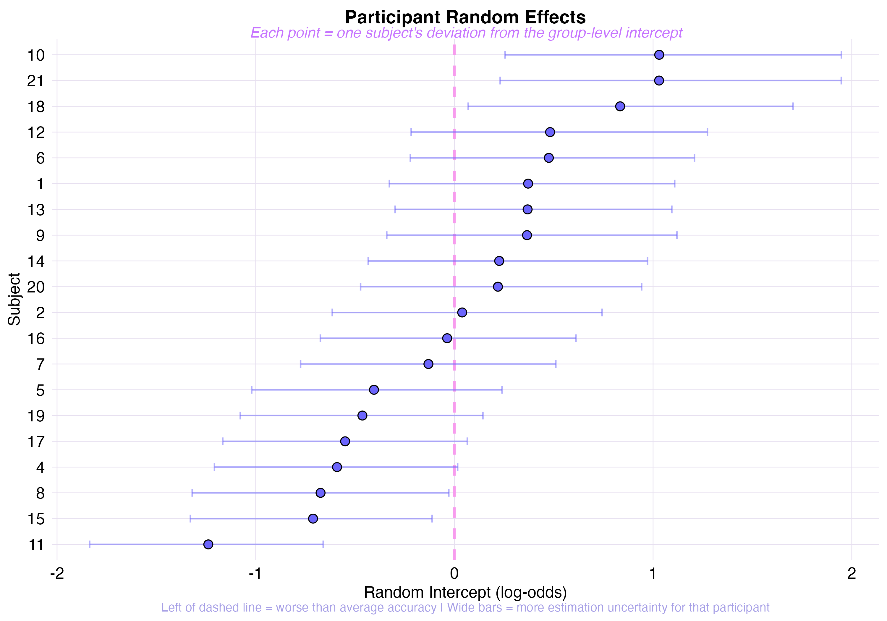

## Raincloud Plot: Full Distributional View

**Figure 15 Interpretation:**

*   **Technical**: The raincloud plot combines three layers: a density estimate (the "cloud"), a boxplot (summary statistics), and jittered raw data points (individual participants). This provides a complete distributional picture that no single summary statistic can capture---revealing skewness, multimodality, and the presence of extreme values.
*   **Theoretical**: The LR and H conditions show both higher medians and wider spreads than F and PB, indicating that representational indeterminacy affects participants to varying degrees---consistent with individual differences in L2 proficiency, L1-L2 phonological distance, and potentially age of acquisition.

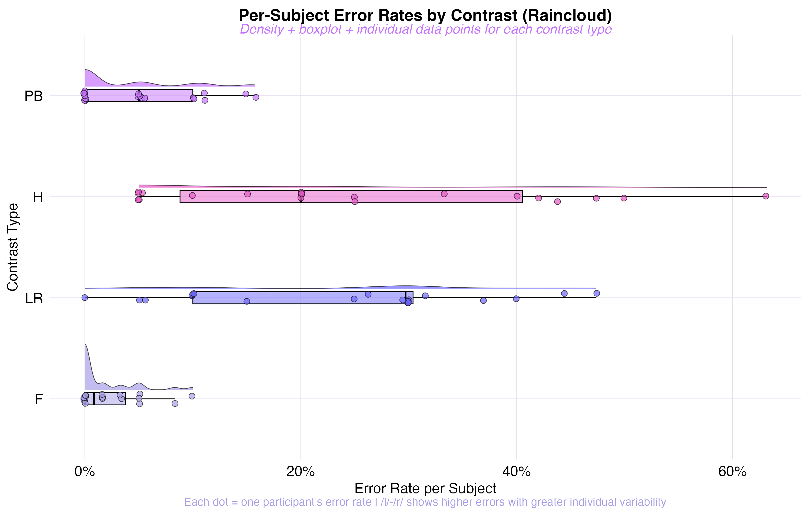

## LOO Model Comparison

We compared the predictive performance of all three models using Pareto-smoothed importance sampling Leave-One-Out Cross-Validation (PSIS-LOO; @vehtari2017), which estimates each model's expected log predictive density (ELPD) for new, unseen observations.

::: {.callout-note title="LOO-CV Results"}
The **Comprehensive** and **Linguistic** models perform nearly identically ($\Delta$ELPD $\approx -0.1$, SE $\approx 1.0$), suggesting that the four-level contrast coding and the three-level linguistic grouping capture equivalent information. The **Distinctness** model, despite using only a single continuous predictor, achieves competitive predictive performance---supporting the parsimony of the gradient mechanism account.
:::

This result has two implications:

1. **Statistical parsimony**: The Linguistic Model's three levels (collapsing F into "Unrelated" and grouping LR with Homophones) lose almost no predictive accuracy compared to the full four-level Comprehensive Model. This confirms that **phonological status**---not the specific contrast label---is the primary explanatory dimension.

2. **Mechanistic parsimony**: The Distinctness Model's competitive performance with a single continuous predictor suggests that a latent gradient of L1-L2 phonological distance underlies the categorical patterns. If a one-dimensional scale can predict accuracy nearly as well as a four-level factor, the mechanism is likely continuous rather than categorical.

# Animated and Interactive Visualizations

Beyond static figures, our analysis script produces interactive and animated outputs to support presentation, pedagogical communication, and exploratory analysis.

**Interactive HTML plots** (open in browser):

*   `17_interactive_error_rates.html` --- Hover for exact error rates and credible intervals per contrast
*   `18_interactive_forest_plot.html` --- Hover for posterior medians and 95% CrIs
*   `19_interactive_distinctness.html` --- Hover for per-subject distinctness, error rate, and trial count

**Core animated GIF sequences** (view directly):

*   `20_credible_interval_buildup.gif` --- Credible intervals expanding from point estimates to full 95% CrI, visualizing the layers of uncertainty
*   `21_error_rate_accumulation.gif` --- Error rates building up from baseline to highest, emphasizing the magnitude of the LR effect
*   `22_mcmc_convergence_lr.gif` --- MCMC chains converging on the LR effect estimate, demonstrating sampler reliability

**Raw data animations:**

*   `36_word_pair_confusion_spectrum.gif` --- The confusion spectrum (Figure 8) animated: contrast rows reveal progressively from F (near white) through PB to H and LR (spreading dark red), building the narrative of increasing phonological interference
*   `37_evidence_accumulation.gif` --- Cumulative accuracy as participants are added one by one; the LR disadvantage is established by subject 10 and remains stable

**Deep analytical animations** (42--46): Animated reveal sequences for key analytical plots, designed for presentation walkthroughs:

*   `42_subject_heatmap_reveal.gif` --- Subject × Contrast Heatmap (Figure 9) with columns revealing F → PB → H → LR
*   `43_pairwise_rope_reveal.gif` --- Pairwise ROPE comparisons (Figure 2) revealing bottom to top
*   `44_ranked_dotchart_reveal.gif` --- All-pairs ranked dot chart with one contrast facet at a time
*   `45_strip_plot_accumulate.gif` --- Word-pair confusion dots accumulating by contrast
*   `46_caterpillar_reveal.gif` --- Subject random effects revealing one by one, worst to best

**Animation showcase** (27--35): Nine distinct animation styles applied to key results---posterior fade-in, error bar slide-up, horizontal interval expansion, vertical growth, camera pan (tilt up/down), focus zoom into the LR posterior, prior-posterior collision, and progressive MCMC trace reveal. These are designed for presentation contexts where sequential visual storytelling enhances comprehension.

**Portfolio GIF** (`00_portfolio_cumulative.gif`): All key visualizations---including the deep analytical plots (Figures 2 and 9)---combined into a single looping narrative arc, with static frames held between animated sequences. Aspect ratios are preserved via white letterboxing to prevent distortion.

# Discussion and Conclusion

## Summary of Findings

Our Bayesian re-analysis of @ota2009 yields four principal conclusions:

1. **Replication with precision.** The Comprehensive Model confirms that the /l/-/r/ contrast elicits a 21.1% false positive error rate [95% CrI: 14.2, 30.2] in Japanese speakers---functionally indistinguishable from true homophones (H). In terms of effect magnitude, the odds of a correct response are reduced by roughly 78% for LR pairs relative to spelling controls. The PB contrast, present in the Japanese L1 inventory, shows no credible effect relative to spelling controls. This directly replicates the original study's central finding using a modern probabilistic framework.

2. **The mechanism is gradient, not categorical.** The Distinctness Model reveals a significant linear relationship between phonological distinctness (operationalized via L1 inventory constraints) and error rates. This supports @ota2009's structural filtering account: representational indeterminacy is not an all-or-nothing phenomenon but scales with the degree of L1-L2 phonological mismatch. The raw observed error rates confirm this gradient, increasing monotonically as distinctness decreases (F: 2% $\to$ PB: 6% $\to$ H: 24% $\to$ LR: 31%). Note that raw rates differ from model-estimated rates (e.g., LR: 31% raw vs. 21.1% model-estimated) because the hierarchical model adjusts for subject- and item-level variability.

3. **Results are robust across multiple dimensions.** We validated our findings through seven complementary checks:
    a. *Sensitivity analysis*: Doubling the prior variance produces near-identical posteriors (Figure 11)
    b. *LOO-CV*: Comprehensive and Linguistic models are predictively equivalent
    c. *Posterior predictive checks*: Global PPC (Figure 10) confirms model adequacy
    d. *Item-level consistency*: LR effects generalize across all word pairs, not driven by outliers (Figure 13)
    e. *Subject-level universality*: The Subject × Contrast Heatmap (Figure 9) confirms all 20 participants show elevated LR error rates
    f. *Pairwise inferential hierarchy*: ROPE analysis (Figure 2) establishes $\text{F} \approx \text{PB} \ll \text{H} \approx \text{LR}$
    g. *MCMC diagnostics*: All $\hat{R} \approx 1.00$, no divergent transitions, adequate ESS

4. **The Bayesian framework adds value.** Beyond replication, the Bayesian approach provides what the original frequentist analysis could not: direct probability statements about parameter values (e.g., "there is a 95% probability the LR effect lies between $-2.1$ and $-0.9$ on the log-odds scale"), sensitivity testing against prior specification, principled model comparison via LOO-CV, and full posterior distributions that reveal not just "is there an effect?" but "how large, how certain, and how variable?"

## Limitations

Several limitations should be noted:

*   **Sample size**: With $N = 20$ participants, our posterior estimates are moderately precise but would benefit from larger samples. The hierarchical structure partially mitigates this by borrowing strength across items and subjects, but the subject-level random effects are estimated with wide credible intervals. Future replications with larger samples would tighten these estimates.
*   **L1 specificity**: All participants were native Japanese speakers. The representational indeterminacy hypothesis predicts *different* confusion patterns for speakers of other L1s (e.g., Arabic speakers should confuse /p/-/b/ but not /l/-/r/). The cross-linguistic comparison in @ota2009 (including Arabic speakers) supports this, but our re-analysis focuses only on the Japanese group.
*   **Distinctness scale assumptions**: The phonological distinctness values (0.0, 0.3, 0.8, 1.0) are theoretically motivated but not empirically derived. Alternative spacing (e.g., 0.0, 0.5, 0.8, 1.0) could yield different slope estimates without changing the ordinal pattern. The Distinctness Model's results should be interpreted as confirming the *ordinality* of the gradient, not the specific metric.
*   **Random effects structure**: We included random intercepts only. Random slopes (allowing the contrast effect to vary by subject) would capture the possibility that some participants are more affected by /l/-/r/ indeterminacy than others. However, with only 20 subjects, fitting random slopes risks convergence issues and overfitting, so we opted for the more conservative intercepts-only specification.

## Implications and Future Directions

Recognizing the comparative framework of @jiao2024, we note that this "structural filtering" model may interact with orthographic depth. While our Distinctness Model confirms that phonology acts as a gradient constraint for Japanese speakers processing English, future work should explore how this interacts with the orthographic "triggering" mechanisms proposed in logographic processing models---particularly given that both Japanese and Arabic use non-Roman scripts, which was itself a design feature of the original Ota et al. study (preventing L1 grapheme-phoneme correspondence rules from confounding the results).

The raw data visualizations (Figures 9--10) suggest a further research direction: the *within-contrast* variability in confusion rates. Not all /l/-/r/ pairs are equally confusable---LAG-CLOTH produces 100% errors while WRONG-SHORT produces 0%. Understanding what drives this item-level variability (word frequency? phonological neighborhood density? position of the /l/-/r/ contrast within the word?) could refine the structural filtering account from a contrast-level to a lexical-item-level theory of representational indeterminacy.

Ultimately, we conclude that **Representational Indeterminacy** is a robust, quantifiable phenomenon: the "Key" to the "Rock" is indeed the "Lock".

# References

::: {#refs}
:::
