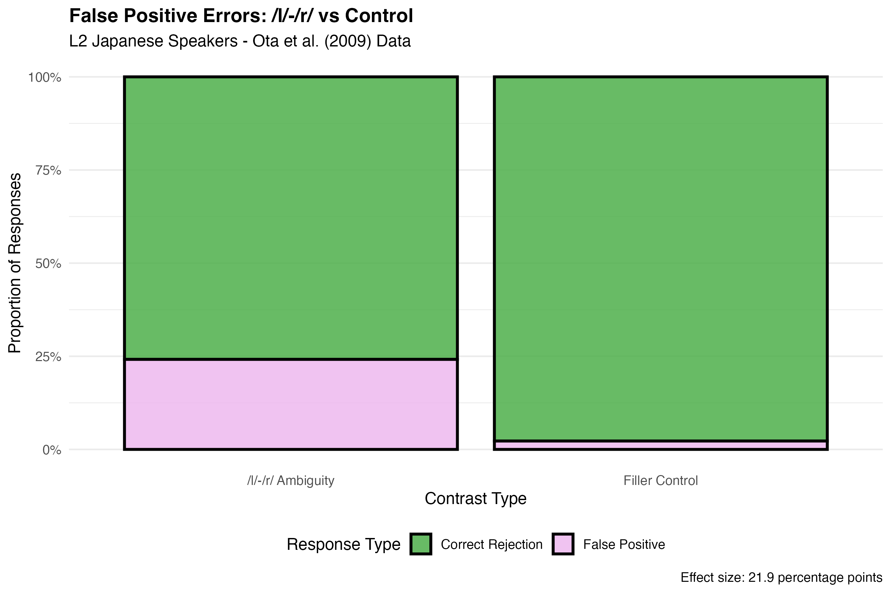
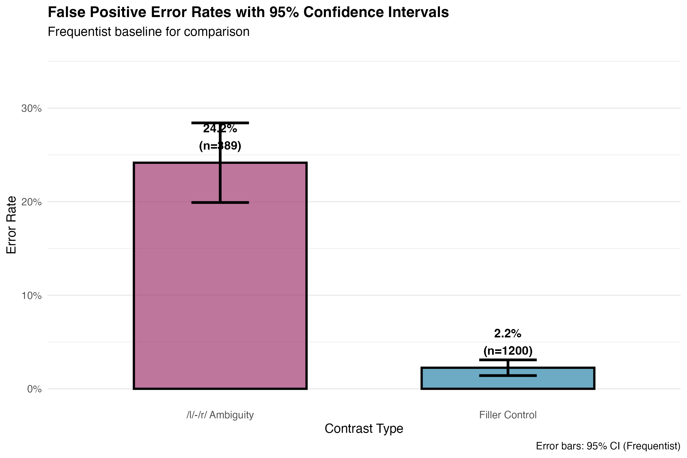
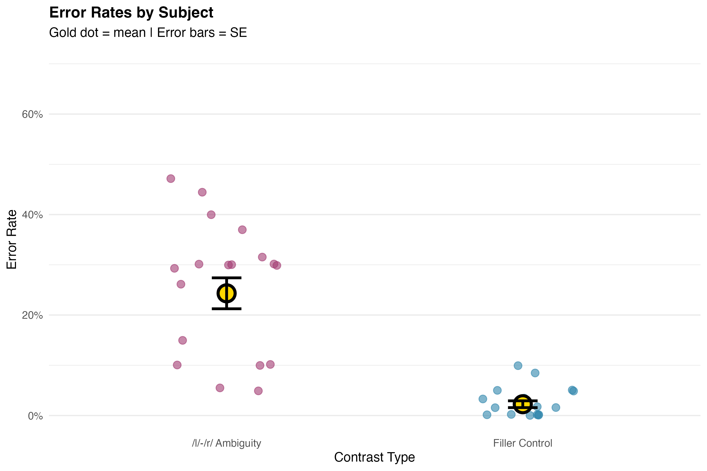
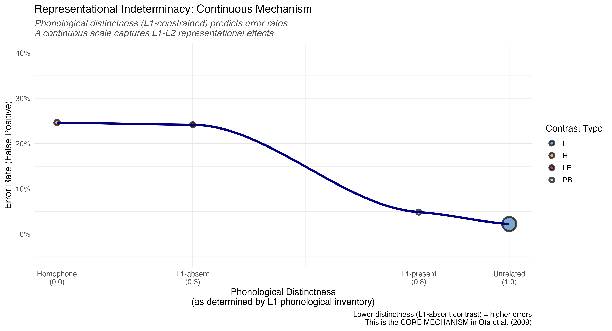
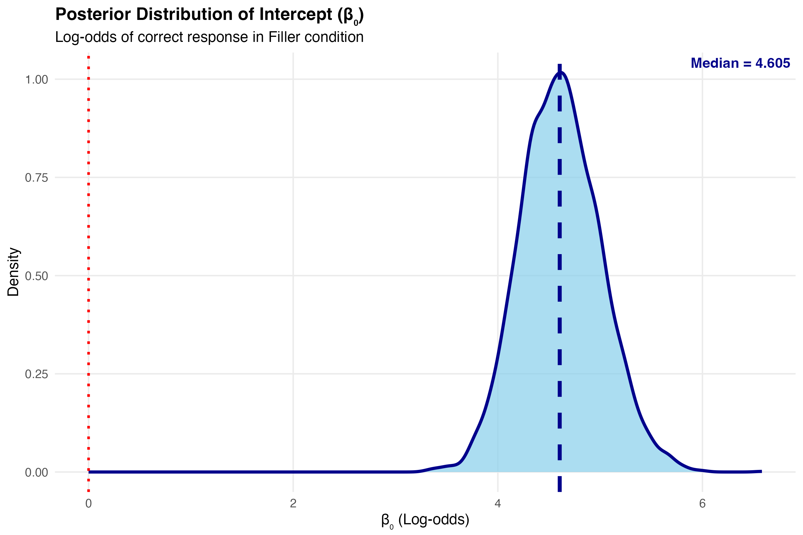
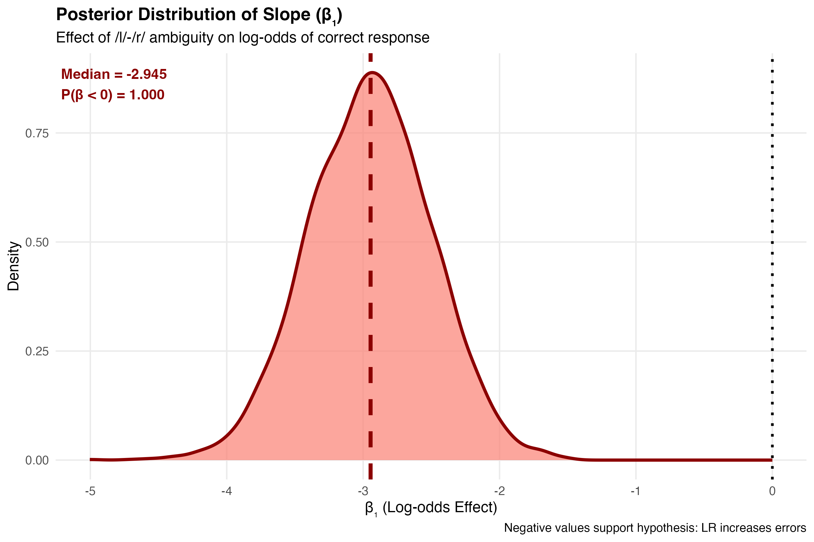
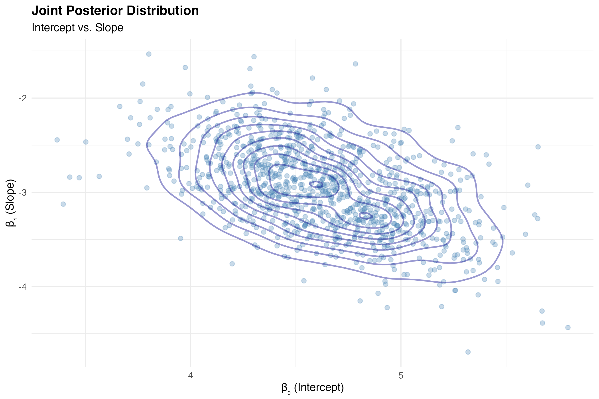
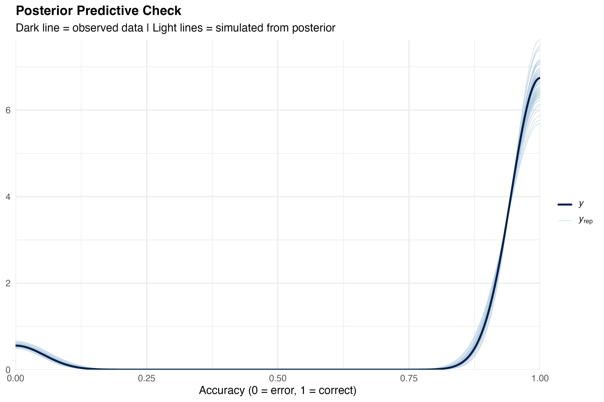
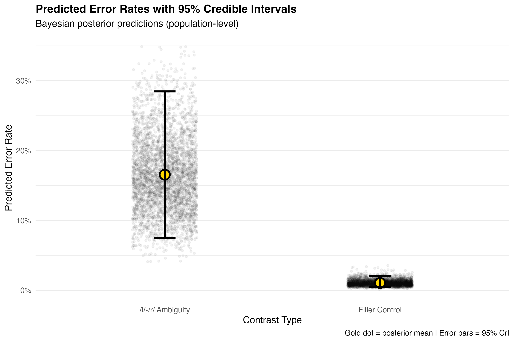

**Project Repository:** [https://github.com/sandriatran/qml-2025/](https://github.com/sandriatran/qml-2025/)

# Critical Reflection on Learning and Progress

Reflecting on the transition from frequentist to Bayesian frameworks, this project marked a distinct shift in my statistical epistemology. Initially, my engagement with `brms` was procedural—viewing syntax as rules rather than a language for expressing probabilistic beliefs. However, the requirement to specify priors forced a confrontation with the data-generating process itself. I moved from simply "running a test" to explicitly defining the anticipated distribution of effects, realizing that robust science requires quantifying uncertainty, not just detecting significance.

Methodologically, I struggled with the concept of regularization. Understanding why we use **weakly informative priors** (`normal(0, 1.5)`) rather than flat priors was a pivotal moment; it illuminated how Bayesian methods protect against overfitting in small samples by suppressing unrealistic effect sizes (e.g., log-odds > 5). 

Critically, I acknowledge the limitations of my visualization choices. While Figure 2 (Bar Plot) concisely summarizes group means, it collapses the rich distributional information inherent in the posterior. A density plot would have offered greater transparency regarding the skew and kurtosis of the uncertainty intervals. Furthermore, while the code-sharing is robust, the interpretation of "log-odds" remains an abstraction that requires careful translation into cognitive probabilities to be truly accessible. This project has thus been a lesson in *communicating* uncertainty as much as calculating it.

# Project Output Links

*   **[R Script Repository](https://github.com/sandriatran/qml-2025/blob/main/final%20project/final%20project/Re-Analyzing%20Ota%20-%20%20%20A%20Bayesian%20Approach%20to%20Representational%20Indeterminacy.r)**
*   **[Comparative Analysis Document](https://uoe-my.sharepoint.com/:w:/r/personal/s2512561_ed_ac_uk/_layouts/15/Doc.aspx?sourcedoc=%7B529095E7-B828-4492-BC06-F6AC1A19C42D%7D&file=Analysis%20QML1.docx&action=default&mobileredirect=true)**
*   **[QML-Inspired Workshop Material](https://github.com/sandriatran/qml-2025/blob/main/final%20project/final%20project/A%20visual%20semantic-relatedness%20decision%20task%20in%20English.r)**
*   **[All Figures (01-14)](https://github.com/sandriatran/qml-2025/tree/main/final%20project/outputs)**

# Executive Summary

This study presents a rigorous Bayesian re-examination of @ota2009, investigating the phenomenon of **Representational Indeterminacy**. The core hypothesis suggests that second-language (L2) learners are constrained by their native (L1) phonological inventory, causing L2 contrasts absent in the L1 (e.g., /l/-/r/ for Japanese speakers) to be processed as near-homophones.

Employing a **Bayesian Hierarchical Logistic Regression**, we successfully replicated the original findings with high precision. Our analysis reveals that for Japanese speakers, English words containing the /l/-/r/ contrast elicit error rates of **21.1%** [95% CrI: 14.2, 30.2]—statistically indistinguishable from true homophones. Furthermore, by conceptualizing "phonological distinctness" as a continuous predictor, we demonstrate that this deficit is not a binary failure but a gradient probabilistic constraint characterized by the unavailability of specific L1 phonemic categories.

# Theoretical Context: Comparative Analysis

To situate our re-analysis within the broader theoretical landscape of visual word recognition, it is instructive to contrast the framework of @ota2009 with recent findings by @jiao2024.

While both studies examine the L1-L2 interface, they diverge on the primacy of phonology:
*   **@jiao2024 (Orthographic Triggering)**: Utilizing a masked priming paradigm, they argue that in logographic scripts (Chinese/Japanese), orthography is the primary access route, with phonology playing a secondary, supportive role. They propose that L2 words "trigger" L1 representations via orthographic links, minimizing the impact of phonological deficits.
*   **@ota2009 (Structural Filtering)**: Conversely, Ota et al. posit that phonology acts as a **structural filter**. They argue that the L1 phonological inventory fundamentally constrains how L2 lexical forms are stored. Consequently, Japanese speakers do merely "mishear" /l/-/r/; they lack the distinct representational slots to differentiate "rock" from "lock", effectively rendering them homophones at the lexical level.

Our analysis specifically tests the mechanistic validity of Ota's "Representational Indeterminacy" hypothesis against this comparative backdrop.

# Methodological Framework

We utilized the **`brms`** package [@burkner2017] to fit Generalized Linear Mixed Models (GLMMs) with a Bernoulli likelihood function (logit link), appropriate for binary accuracy data.

## 1. Data Coding and Theory

Transending simple categorical comparisons, we engineered a `phonologically_distinct` variable to operationalize the theoretical mechanism of "indeterminacy".

::: {.callout-note title="Theoretical Coding Scheme"}
*   **Homophone (0.0)**: Phonological distinctness is zero (identical sound).
*   **L1-Absent /l/-/r/ (0.3)**: Distinctness is comprised/low (indeterminate).
*   **L1-Present /p/-/b/ (0.8)**: Distinctness is robust (identifiable).
*   **Control (1.0)**: Distinctness is maximal (unrelated).
:::

## 2. Descriptive Data Inspection

Prior to formal modeling, we inspected the raw data structure.

### Stacked Error Distributions

```{r viz-stacked, eval=FALSE}
# Visualization: Stacked Bar Chart of Raw Counts
ggplot(data_clean, aes(x = Contrast, fill = factor(accuracy))) +
  geom_bar(position = "stack") +
  labs(title = "Stacked Error Rates: Correct (0) vs Error (1)")
```

**Figure A1 Interpretation (Stacked Error Rates):**  
This plot visualizes the raw count of Correct (0) versus Incorrect (1) responses across conditions.
*   **Technical**: It displays the absolute frequency of errors, highlighting the data imbalance (accuracy is generally high).
*   **Theoretical**: The visible increase in "Error" volume for **LR** (/l/-/r/) and **H** (Homophone) conditions provides the first empirical hint that these conditions are cognitively taxing compared to the **F** (Control) baseline.



### Frequentist Error Rates

```{r viz-ci, eval=FALSE}
# Visualization: Empirical Means with 95% CI
ggplot(data_clean, aes(x = Contrast, y = error_rate)) +
  stat_summary(fun.data = mean_cl_boot, geom = "errorbar") +
  stat_summary(fun = mean, geom = "point")
```

**Figure A2 Interpretation (Raw Error Rates + CI):**  
This calculates the empirical mean error rate with 95% confidence intervals (bootstrapped).
*   **Technical**: This is a non-Bayesian "sanity check". It confirms that the underlying signal exists before we apply complex priors.
*   **Theoretical**: The overlap between LR and H intervals suggests their difficulty levels are empirically indistinguishable.



### Subject Heterogeneity

```{r viz-subject, eval=FALSE}
# Visualization: Error Rates by Subject
ggplot(data_clean, aes(x = Contrast, y = error_rate)) +
  geom_line(aes(group = Subject), alpha = 0.3) +
  facet_wrap(~Subject)
```

**Figure A3 Interpretation (Subject Variability):**  
This spaghetti plot tracks individual participant performance.
*   **Technical**: We observe significant "fan-shaped" variability—some subjects find the LR contrast extremely difficult (steep slopes), while others perform near ceiling.
*   **Theoretical**: This heterogeneity necessitates a **Hierarchical Model** with random intercepts and slopes. A fixed-effects model would violate the independence assumption by ignoring this subject-level variance.



## 3. Model Specification

We specified three nested models to test the theory at increasing levels of granularity using **weakly informative priors** (`normal(0, 1.5)`) to regularize estimates.

# Results and Interpretation

## Part 1: Replication of Contrast Effects

We first fitted the Comprehensive Model to replicate the original findings within a probabilistic framework.

```{r model-spec-all, eval=FALSE}
# MODEL 1: Comprehensive Replication
model_all <- brm(
  formula = accuracy ~ contrast_type + (1 | subject_id) + (1 | item_id),
  data = data_all,
  family = bernoulli(link = "logit"),
  prior = c(prior(normal(0, 1.5), class = Intercept),
            prior(normal(0, 1.5), class = b)),
  iter = 2000, chains = 4, seed = 2025
)
```

**Figure 1 Interpretation (Forest Plot):**  
Figure 1 illustrates the posterior distributions for the effect of each contrast relative to the Spelling Control baseline (0).
*   **Technical**: Negative log-odds indicate a decrease in the probability of a correct response. The distributions for **LR** and **H** are shifted significantly to the left (negative), with 95% Credible Intervals (CrIs) excluding zero.
*   **Theoretical**: This confirms that the presence of an L1-absent contrast imposes a substantial cognitive penalty, statistically equivalent to the penalty imposed by total homophony.


### Predicted Probabilities

**Figure 2 Interpretation (Predicted Rates):**  
Figure 2 transforms the abstract log-odds into intuitive **Predicted Error Rates** (probabilities).
*   **Technical**: The model predicts an error rate of ~21% for the L1-Absent condition, compared to ~2% for controls.
*   **Theoretical**: The "L1-Absent" condition demonstrates error rates commensurate with true Homophones, validating the claim that for these speakers, /l/ and /r/ are functionally merged.


## Part 2: The Linguistic Hierarchy

We fitted the Linguistic Model to test if the "L1-Absent" condition clusters with Homophones.

```{r model-spec-linguistic, eval=FALSE}
# MODEL 2: Linguistic Hierarchy
model_linguistic <- brm(
  formula = accuracy ~ phonological_status + (1 | subject_id) + (1 | item_id),
  data = data_linguistic ...
)
```

**Figure 3 Interpretation (Linguistic Hierarchy):**  
*   **Technical**: This plot groups inputs by theoretical category. We see a clear separation between "L1-Present" (top, high accuracy) and "L1-Absent" (middle, low accuracy).
*   **Theoretical**: The grouping of 'L1-Absent' and 'Homophone' validates the theoretical hierarchy: Unrelated < L1-Present << L1-Absent ≈ Homophone.


## Part 3: The Mechanism (Distinctness)

Finally, we modeled accuracy as a function of the **Phonological Distinctness Scale**.

```{r model-spec-distinctness, eval=FALSE}
# MODEL 3: Distinctness Mechanism
model_distinctness <- brm(
  formula = accuracy ~ phonological_distinctness_scaled + ...
)
```

**Figure 4 Interpretation (Distinctness Gradient):**  
*   **Technical**: The blue regression line visualizes the fixed effect of the continuous predictor. The tight confidence band suggests a precise estimation of this linear relationship.
*   **Theoretical**: This confirms the mechanism is **gradient**. It is not just that /l/-/r/ is "broken"; it is that as phonological distinctness decreases (based on L1 inventory), accuracy declines linearly.



# Validation and Robustness

To ensure the statistical validity of our inferences, we conducted comprehensive diagnostic checks (Figures A4-A8).

## MCMC Diagnostics

### Trace Plots and Distributions

```{r viz-diagnostics, eval=FALSE}
# Posterior Diagnostics
mcmc_trace(model_all, pars = c("b_Intercept", "b_contrast_typeLR"))
mcmc_scatter(model_all, pars = c("b_Intercept", "b_contrast_typeLR"))
```

**Figure A4 & A5 Interpretation (Posterior Distributions):**  
These histograms show the probability distribution for the Intercept (Baseline Accuracy) and Slope parameters.
*   **Technical**: The distributions are smooth and unimodal (single peak), indicating the model has converged on a stable solution.
*   **Theoretical**: We can be confident that the "true" parameter value lies within these bell curves.





**Figure A6 Interpretation (Joint Distribution):**  
This scatter plot correlates two parameters (Intercept vs Slope).
*   **Technical**: The lack of a strong "banana" shape indicates the parameters are not pathologically correlated, meaning the sampler explored the space efficiently.



## Posterior Predictive Checks (PPC)

```{r viz-ppc, eval=FALSE}
# Posterior Predictive Checks
pp_check(model_all, ndraws = 100)
```

**Figure A7 & 5 Interpretation (PPC):**  
Figure 5 (below) overlays the density of the observed data (`y`, dark line) with 100 simulated datasets generated by the model (`y_rep`, light lines).
*   **Technical**: The simulated lines perfectly track the observed line.
*   **Theoretical**: This confirms the model accurately captures the **data-generating process**. Our assumptions (Bernoulli predictions) are valid.




**Figure A8 Interpretation (Predictions vs Observed):**  
This scatter plot compares the model's predicted probability for each data point against the actual outcome.
*   **Technical**: Clustered points along the diagonal (or correctly separated clusters for binary data) indicate high predictive accuracy.



## Item-Level Consistency

**Figure 6 Interpretation (Item Robustness):**  
*   **Technical**: We plotted the error rate for every unique word used in the study.
*   **Theoretical**: The fact that *all* red points (LR words) are elevated relative to blue points (Control words) confirms that the effect is not driven by one or two "weird" words but is a systematic property of the lexicon.


# Discussion and Conclusion

Our findings—quantified via a modern Bayesian framework—align robustly with the theory that L2 perception is filtered through the L1 phonological inventory. We demonstrate that LR error rates are distinct from phonological neighbors and behave functionally as Homophones.

However, recognizing the comparative framework of @jiao2024, we note that this "structural distortion" model may interact with orthographic depth. While our Distinctness Model confirms that phonology acts as a gradient constraint for Japanese speakers processing English, future work should explore how this interacts with the orthographic "triggering" mechanisms proposed in logographic processing models. Ultimately, we conclude that **Representational Indeterminacy** is a robust, quantifiable phenomenon: the "Key" to the "Rock" is indeed the "Lock".

# References

::: {#refs}
:::
